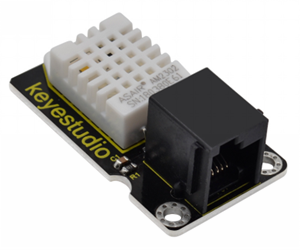
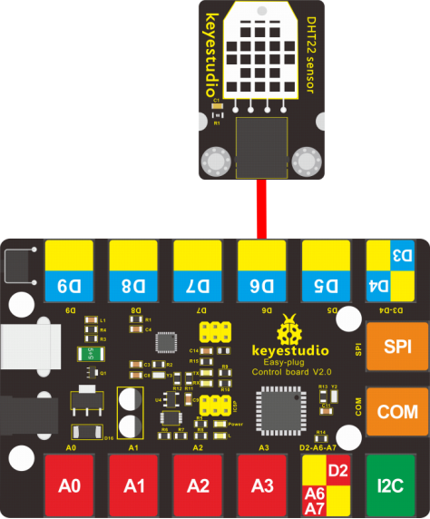
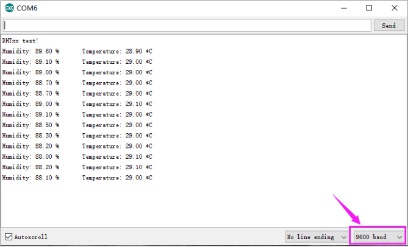

# KS0431 EASY plug DHT22 Temperature and Humidity Sensor



## 1. Overview

This EASY plug DHT22 digital temperature and humidity sensor is a composite Sensor which contains a calibrated digital signal output of the temperature and humidity.

The dedicated digital modules collection technology and the temperature and humidity sensing technology are applied to ensure that the product has high reliability and excellent long-term stability.

Qualities of excellent quality, ultra-fast response, strong anti-interference, and high cost performance make it a wide applied application or even the most demanding one.

The sensor comes with 2 fixed holes, very easy to mount on any other devices.

For simple connection, the sensor has broken out the 4pins into a Crystal socket, so that you can direct connect the sensor to EASY plug control board using only an RJ11 cable for communication.

**Applications:** dehumidifier, testing and inspection equipment, consumer goods, automotive, automatic control, data loggers, weather stations, home appliances, humidity regulator, medical and other humidity measurement and control.

**Special Note:**

The sensor/module is equipped with the RJ11 6P6C interface, compatible with our keyestudio EASY plug Control Board with RJ11 6P6C interface.

If you have the control board of other brands, it is also equipped with the RJ11 6P6C interface but has different internal line sequence, can’t be used compatibly with our sensor/module.

## 2. Specifications

- Operating voltage: DC 3.3V-5V
- Interface: EASY plug
- Output signal: single-bus digital signal
- Humidity measurement range: 0----100%RH
- Humidity measurement accuracy: ±2%RH
- Temperature measurement range: - 40℃ to 80℃
- Temperature measuring accuracy: ±0.5℃
- Dimensions: 43mm * 26mm * 18mm
- Weight: 9.3g

## 4. Hookup Guide



## 5. Source Code

Download Resource: [Resource](./Resource.7z)

Note： before uploading the code, you need to import the library files; otherwise, the code upload will fail.

```c
#include "DHT.h"
#define DHTPIN 3     // define the connection pin 
#define DHTTYPE DHT22   
DHT dht(DHTPIN, DHTTYPE);
void setup() 
{
  Serial.begin(9600); //set the baud rate 
  Serial.println("DHTxx test!");//print the character and line wrap
  dht.begin();
}

void loop() 
{
  float h = dht.readHumidity(); // calculate the humidity value
  float t = dht.readTemperature(); //calculate the temp.value
  if (isnan(t) || isnan(h)) 
  {
    Serial.println("Failed to read from DHT");//show the contents and line wrap
  } 
  else 
  {
    Serial.print("Humidity: "); //print the humidity
    Serial.print(h); //print the humidity value
    Serial.print(" %\t");//print the content
    Serial.print("Temperature: "); //print the temperature
	Serial.print(t);//print the temperature value 
	Serial.println(" *C");//print the temperature unit and line wrap
  }
}
```

## 6. Test Result

Hook up the sensor to main board and upload the source code. Power on, open the serial monitor and set the baud rate to 9600; you are able to see the current ambient temperature and humidity value. As shown below.

